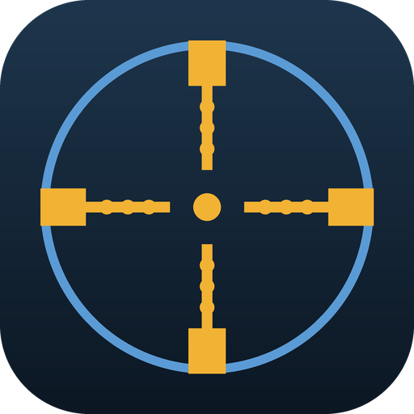

<div align="center">



# CS2 Practice Host

친구와 CS2 연습 서버를 여는 Windows 도구

[다운로드](https://github.com/kimlog0415/cs2-practice-host/releases/latest) · [사용법](https://cs2.logstone.net/) · [변경 내역](CHANGELOG.md)

</div>

---

## 무엇을 해결하나

CS2에서 파티로 친구를 모아 연습 게임을 시작하면, 방장만 들어가고 친구들은 「게임 서버와 연결할 수 없습니다」로 튕기는 일이 있습니다.

원인은 타이밍입니다. 방장이 시작을 누르면 CS2가 친구들에게 「접속해」 신호를 보내는데, 방장의 서버가 Steam에 등록되어 주소를 받기까지 1~2초가 걸립니다. 친구가 그 전에 신호를 받으면 빈 주소로 접속을 시도하고, 10초 뒤 타임아웃된 뒤 다시 시도하지 않습니다. 어떤 판은 되고 어떤 판은 안 되는 이유가 이것입니다. 방화벽이나 공유기 설정과는 무관합니다.

이 도구는 대기실을 거치지 않습니다. 서버를 먼저 완전히 띄운 다음, 주소를 친구에게 건넵니다.

## 쓰는 법

### 방장

1. 앱을 켜고 모드·맵·봇을 고릅니다.
2. ▶ 버튼을 누릅니다. CS2가 켜지면서 서버가 열립니다.
3. 서버가 열리면 참가 링크가 자동으로 복사됩니다. 친구에게 보내세요.
4. 게임 안에서 F10을 누르면 맵·모드를 바꿉니다. 들어와 있는 친구들은 그대로 남습니다.

CS2는 반드시 이 앱의 ▶ 버튼으로 켜 주세요. Steam에서 직접 켜면 앱이 서버 주소를 읽지 못합니다.

### 친구

받은 링크를 누르면 안내 페이지가 열리고, 거기서 「게임 접속하기」를 누르면 CS2가 켜지면서 서버로 들어갑니다. 따로 설치하거나 개발자 콘솔을 켤 필요가 없습니다.

## 알아두실 것

- 방장이 게임에서 메뉴로 나가면 서버가 닫히고 친구들도 모두 끊깁니다. 서버가 방장의 게임 안에서 돌기 때문입니다.
- 봇을 한쪽 팀으로만 몰면 실제 인원이 「사람 수 + 2」에서 멈춥니다. 한 팀이 상대보다 2명 넘게 많아질 수 없다는 게임 규칙 때문입니다. 「양쪽에 섞기」로 두면 고른 수만큼 들어옵니다.
- 봇 설정은 맵을 새로 열 때 반영됩니다. 게임 도중에 바꾸면 그 판에는 변화가 없습니다.
- 콘솔로 연 서버는 주소를 아는 사람이면 누구나 들어올 수 있습니다. 공개된 곳에 올리지 말고 친구에게만 보내세요.
- 연습용입니다. 매치메이킹·프리미어 같은 공식 경기와는 무관합니다.

## 이 앱이 하는 일과 하지 않는 일

서명이 없는 프로그램이라 Windows가 경고를 띄웁니다(「추가 정보」 → 「실행」). 그래서 무엇을 하는지 밝혀 둡니다.

하는 일

- 레지스트리에서 Steam 설치 위치를 읽어 CS2 폴더를 찾습니다.
- CS2의 cfg 폴더에 설정 파일을 만듭니다 — `cs2host_change.cfg`, `cs2host_bind.cfg`, `gamemode_*_server.cfg`. 전부 첫 줄에 이 앱이 만들었다는 표시가 들어가고, 표시가 없는 파일은 건드리지 않습니다.
- **F10 키를 다시 지정합니다.** 기존에 F10을 쓰고 계셨다면 덮어씌워집니다.
- Steam을 실행 인자와 함께 실행합니다(`-applaunch 730 -condebug +exec ... +map ...`).
- CS2가 남기는 `console.log`를 읽어 서버 주소를 찾습니다.
- 실행 중인 cs2.exe가 이 앱으로 켠 것인지 확인합니다.
- 서버 주소를 클립보드에 복사합니다. 다른 프로그램이 클립보드를 잡고 있으면 복사하지 못했다고 알려 줍니다.
- 설정을 `%APPDATA%\CS2PracticeHost\settings.json`에 저장합니다.
- `?` 버튼을 누르면 기본 브라우저로 [사용법 페이지](https://cs2.logstone.net/)를 엽니다.

하지 않는 일

- 게임 메모리를 읽거나 쓰지 않습니다.
- 키 입력이나 마우스를 조작하지 않습니다.
- 게임 파일을 고치지 않습니다.
- 어떤 정보도 보내지 않습니다. 앱이 직접 주고받는 네트워크 통신이 없습니다. 바깥으로 나가는 것은 `?` 버튼으로 브라우저를 여는 것뿐이고, 그때도 넘기는 정보는 없습니다.

공식 콘솔 명령, cfg 파일, 실행 인자, 로그 읽기만 사용합니다.

## 직접 빌드하기

```
dotnet build -c Release
```

결과물은 `bin/Release/net48/CS2PracticeHost.exe` 하나입니다. .NET Framework 4.8을 쓰고 NuGet 의존성이 없어 DLL이 따로 없습니다.

릴리스에 올린 파일의 SHA256은 릴리스 페이지에 함께 있습니다.

## 고지

Valve Corporation 및 Counter-Strike와 무관한 비공식 도구입니다. Valve의 로고나 자산을 포함하지 않습니다.

---

<div align="center">

### English

</div>

A Windows tool for opening a Counter-Strike 2 practice server with friends.

When you start a practice game from a party, friends often fail to join with "Could not connect to the game server". The host's listen server needs a second or two to register with Steam and get its address, but the invite signal goes out before that — so friends try to connect to an empty address, time out, and never retry.

This tool skips the lobby. It opens the server first, then hands you a link to send.

**Host** — pick mode, map and bots, press ▶. CS2 launches and the server opens. A join link is copied automatically. Press F10 in game to change map or mode; connected friends stay in. Always launch CS2 with the ▶ button — if you start it from Steam directly, the app cannot read the server address.

**Friends** — click the link, then "게임 접속하기" on the page that opens. Nothing to install, no developer console.

**Notes** — if the host leaves to the main menu the server closes. Bots piled on one team cap at "humans + 2" due to a team size rule. Bot settings apply when a map is loaded. Anyone with the address can join, so share it privately.

**What it does** — reads the Steam install path from the registry, writes config files into the CS2 cfg folder (marked as its own; never touches files it did not create), rebinds F10, launches Steam with arguments, reads `console.log` for the server address, copies that address to the clipboard (and says so when another program blocks it), stores settings in `%APPDATA%`, and opens the [usage page](https://cs2.logstone.net/) in your browser from the `?` button.

**What it does not do** — no game memory access, no input simulation, no game file modification. It sends nothing: the app makes no network calls of its own, and the `?` button only opens a browser without passing anything along.

Build with `dotnet build -c Release`. Targets .NET Framework 4.8 with no NuGet dependencies, so the output is a single exe.

Unofficial tool, not affiliated with Valve Corporation or Counter-Strike. Contains no Valve logos or assets.
